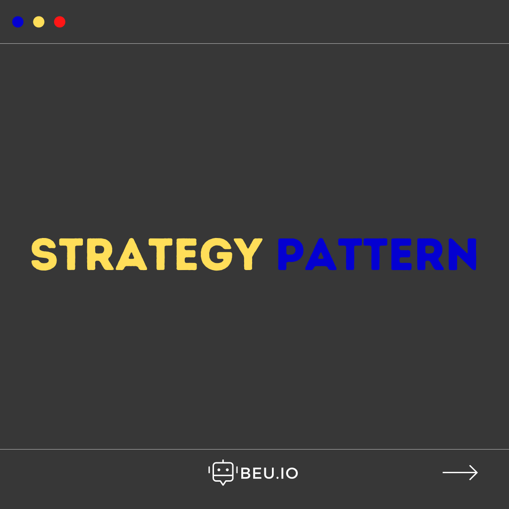
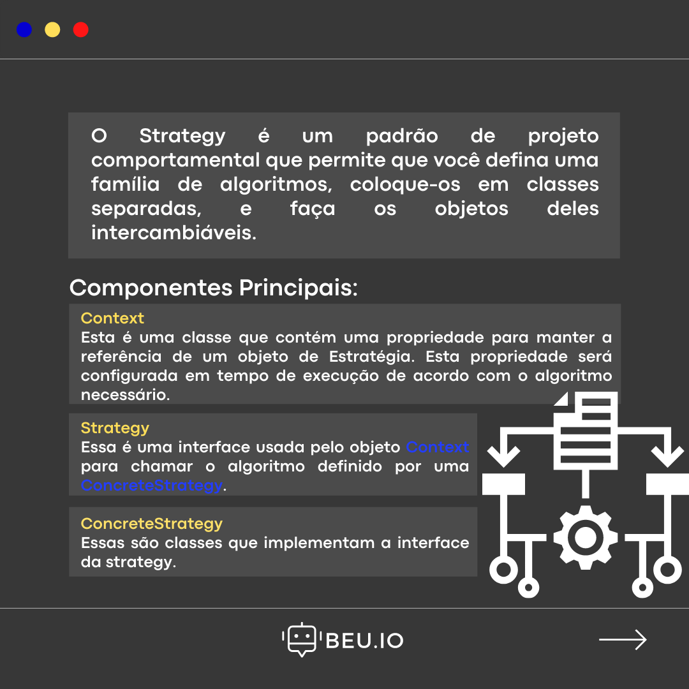
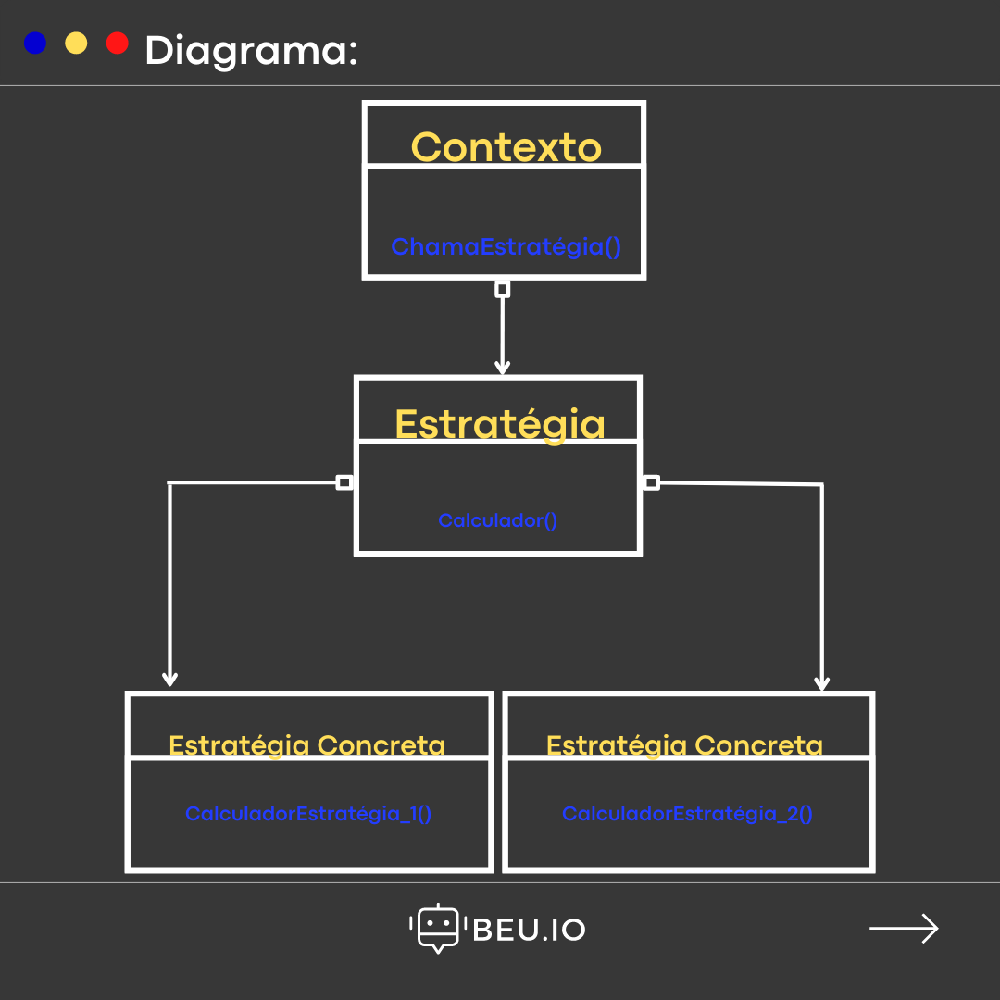
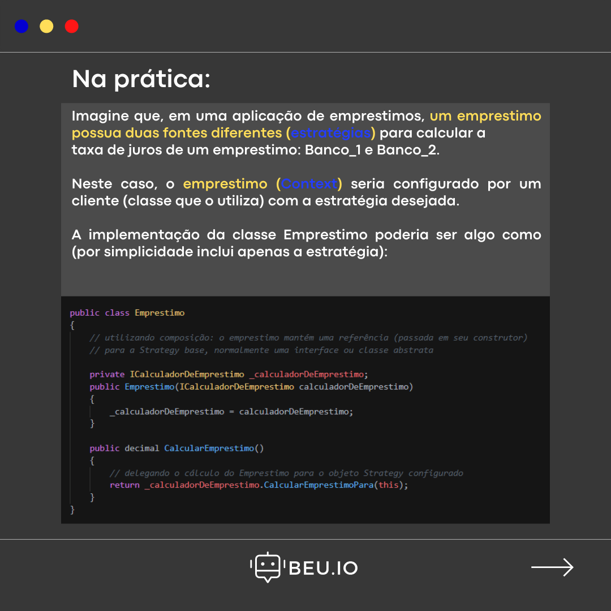
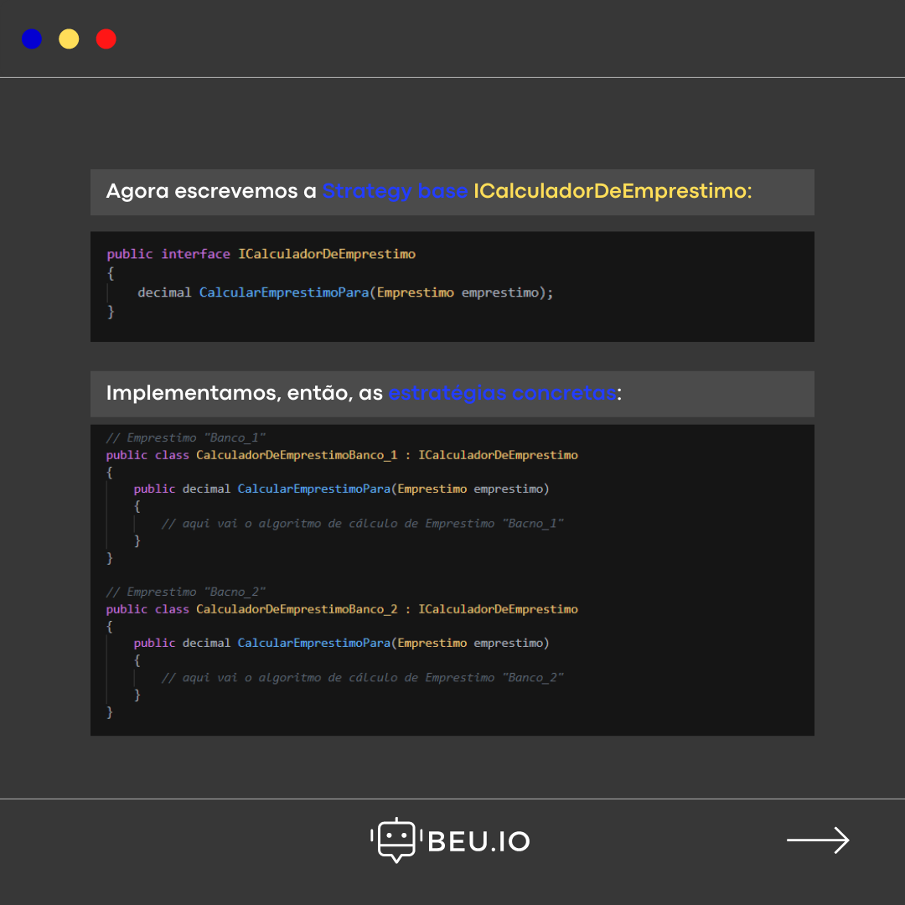
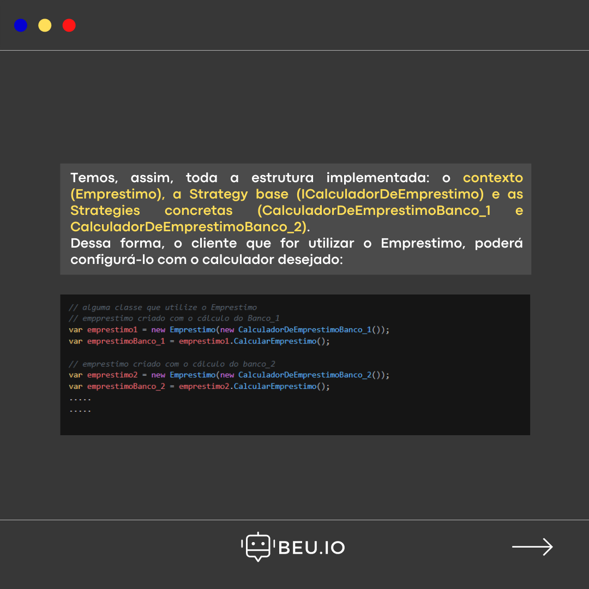
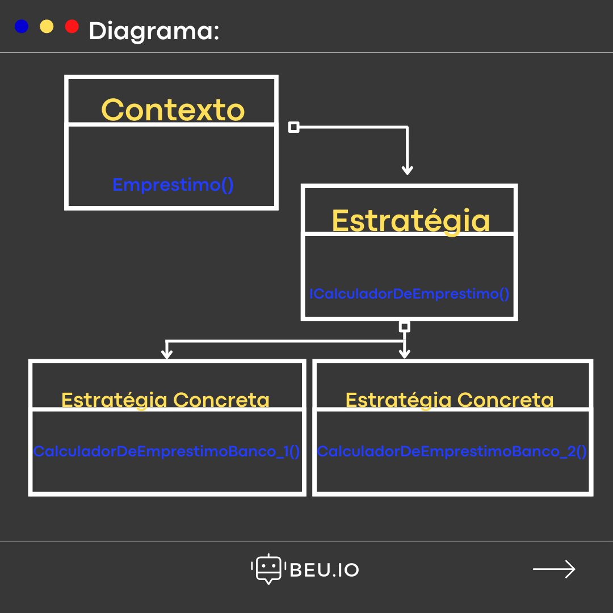

# DesignPatterns
Repositório Criado para aplicar diferentes tipos de Design Patterns

--- 

<h3><a href="https://github.com/OseiasBeu/DesignPatterns/tree/main/Strategy" target="blank">Strategy</a></h3>

 
  
  
  
  
  
  
  

---